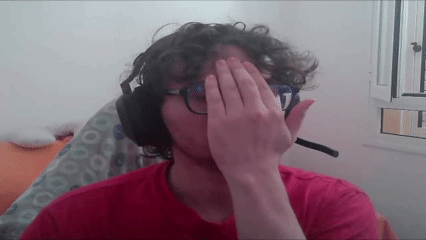

# Práctica 2. Funciones básicas de OpenCV

## Contenidos

- **Descripción** 
- **Planteamiento de cada tarea**
- **Conversaciones con IA**
- **Referencias**

## Descripción  

Al igual que en la práctica anterior, se han llevado a cabo una serie de ejercicios básicos para una toma de contacto con la librería OpenCV, así cómo acceder y modificar el valor de un pixel, umbralizados y entre otros. Las tareas llevadas a cabo son las siguientes:

- Realizar la cuenta de píxeles blancos por fila. Determinar el valor máximo de píxeles blancos para filas, mostrando el nº de filas y sus respectivas posiciones para aquellas filas que cuyo cantidad de balnc pixeles blanco sean mayores al 90% del valor máximo obtenido. Resaltar estas filas.

- Aplicar el umbralizado de la imagen resultante de Sobel (8 bits) y realizar el conteo de filas y columnas parecido al del ejercicio anterior. Destacar aquellas filas y columnas cuyos porcentaje de blanco supere el 90% del máximo. Remarcar las filas y columnas que cumplan dicha condición. Comparar resultados entre Sobel y Canny.

- Tras ver los vídeos planteados, proponer una demostración de la parte de procesamiento de la imagen, tomando como punto de partida alguna de los videos. Se implementaron dos demos: un sistema de zoom centrado en la cara detectada por el modelo YUNet, y otra que redimensiona la imagen directamente hacia el centro de cada cara detectada.

## Planteamiento de cada tarea
  
### Tarea 1: Detección de filas con mayor cantidad de píxeles (Canny)

**Procedimiento:**
Primero, se obtiene el valor total pixeles por columna utilizando `cv2.reduce(canny, 0, cv2.REDUCE_SUM, dtype=cv2.CV_32SC1)`, lo que devuelve la suma de valores por cada columna en formato vector o fila **(aunque se hace para almacenar estos valores para más tarde)**. Y se obtiene suma los pixeles por filas, devolviendo una lista de listas de 1 sólo elemento, mediante `cv2.reduce(canny, 1, cv2.REDUCE_SUM, dtype=cv2.CV_32SC1)`, . Seguidamente, buscamos el valor máximo  de éste último, mediante `maxfil = np.max(row_counts)`.

Seguidamente se deben calcular `rows` y `cols`, estos son los valores que se representan en los histogramas, normalizandolos y dando como resultado el nº de píxeles blancos por fila y columna respectivamente.

La finalidad de esta tarea es detectar aquellas filas que superen el 90% del valor de ese valor `maxfil`, y destacar estas con lineas. Para ello, se recorre cada "fila" del `row_counts` y se verifica que su valor sea mayor al 90% del máximo. En caso afirmativo, se dibuja una recta en esa fila.

Finalmente, se muestra la imagen con las líneas añadidas y el histograma que representa el porcentaje de pixeles blancos por fila.

### Tarea 2: Comparación entre Sobel y Canny con umbralizado

Para esta tarea se parte de una imagen en escala de grises y aquí la tarea se divide en dos:

La primera consiste en preparar una imagen en la que aplicar Sobel y escalar a 8 bits, a la que posteriormente se le aplica un umbralizado con valor 100, y luego, de la misma forma que en la tarea 1 se encuentran las filas y columnas de mayor densidad de píxeles y se reseltan usando primitivas (líneas de 2px de densidad)

La segunda consiste en tomar la imagen a la que le aplicamos Canny en la tarea 1 y aprovechar las variables previas de la tarea 1 para encontrar y marcar con primitivas las columnas con mayor densidad de píxeles (puesto a que ya habíamos encontrado y marcado las filas con mayor densidad de píxeles en la tarea 1)

Finalmente, se visualizan los resultados en cuatro gráficos, donde vemos las dos imágenes con sus respectivas gráficas por columnas y por filas

En las gráficas podemos observar claramente como el método Sobel es considerablemente más sensible al ruido que el método Canny, el cual tiene un perfil global más preciso, sin picos demasiado exagerados, y presenta una mejor continuidad en sus gráficas que Sobel

### Tarea 3: Demostración de procesamiento en tiempo real con detección de caras

**Procedimiento:**
Se implementaron dos demostraciones interactivas basadas en la detección de caras utilizando el modelo YUNet (`face_detection_yunet_2023mar.onnx`):

**Demo 1: Zoom centrado en la cara detectada**

1. Se inicia una captura de video con `cv2.VideoCapture(0)`.
2. En cada iteración, se lee un fotograma del video y se ajusta su tamaño al requerido por el modelo (320x320).
3. Se ejecuta el detector de caras: `_, faces = detector.detect(frame)`.
4. Si se detecta una cara (`faces is not None`):
   - Se extraen las coordenadas del centro de la cara: `(x + fw // 2, y + fh // 2)`.
   - Se dibuja un círculo rojo en el centro de la cara.
   - Se aplica una función `zoom_hacia_punto()` que recorta la región alrededor del centro y la redimensiona para hacer zoom progresivo (factor inicial 0.1, incrementando hasta 2.0).
   - Si no hay cara detectada, se hace zoom al centro de la imagen completa.
5. El resultado se muestra en una ventana llamada "Zoom".
6. Se detiene presionando ESC.  
  

**Demo 2: Redimensionamiento de la ventana**  

*Este caso lo añadimos como curiosidad y principalmente por que nos hizo gracia el cómo se aumentaba o disminuía el tamaño de la ventana de la cámara.*

El procedimiento el similar al anetrior, sólo que en lugar de modificar el frame, manteniendo las dimensiones de la ventana, esta últimas dependian del movimiento del usuario cuya cara habia sido detectada.

**Función auxiliar `zoom_hacia_punto(frame, punto_medio, zoom=2.0)`:**
- Calcula el rectángulo de recorte centrado en `punto_medio`.
- Ajusta los límites para evitar salirse de la imagen.
- Recorta la región y la redimensiona al tamaño original del frame usando interpolación cúbica (`cv2.INTER_CUBIC`).

Ambas demos muestran cómo se puede aplicar procesamiento de imágenes en tiempo real combinando detección de objetos (caras) con transformaciones geométricas básicas.

## Conversaciones con IA

- Conversación con Claude Sonnet 5, 
    - Finalidad -> Adaptar un código para realizar el zoom obtenido de rebuscar en internet
    - [Enlace](https://claude.ai/share/d4449072-895e-4dba-a371-08a822129108)

## Referencias

- Enlace a una lista de reproducción de videos sobre OpenCV, se han visto un par de videos para entender la dinámica de la librería
    - [Enlace](https://www.youtube.com/playlist?list=PLzMcBGfZo4-lUA8uGjeXhBUUzPYc6vZRn)
- Link de la página donde se obtuvo la función *zoom_hacia_punto* original
    - [Enlace](https://learnopencv.com/center-stage-for-zoom-calls-using-mediapipe/)

- Vídeos de referencia para la Tarea 3:
    - [My little piece of privacy](https://www.niklasroy.com/project/88/my-little-piece-of-privacy)
    - [Messa di voce](https://youtu.be/GfoqiyB1ndE?feature=shared)
    - [Virtual air guitar](https://youtu.be/FIAmyoEpV5c?feature=shared)
